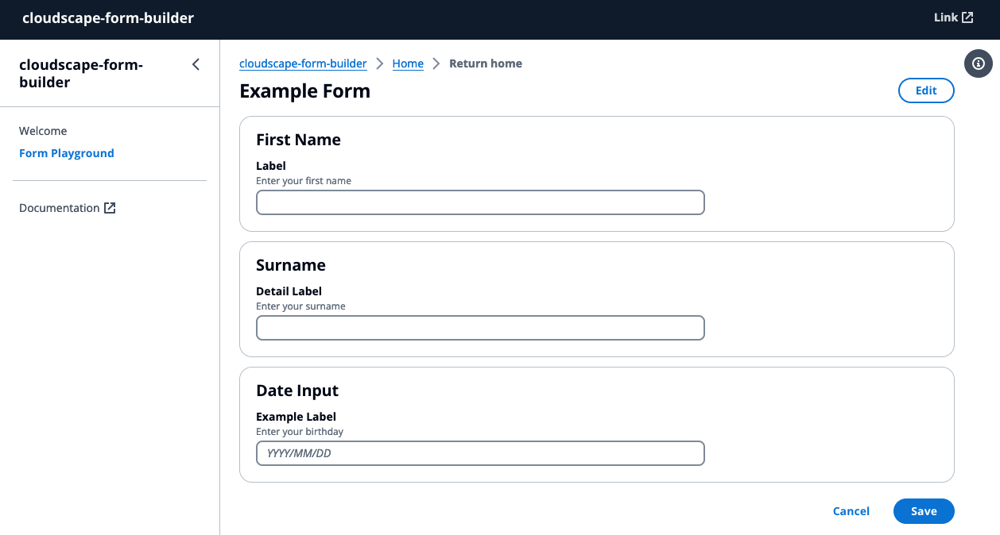

# cloudscape-form-builder Readme

This solution was built to accelerate the development of web forms on the frontend using the [AWS Cloudscape Design System](https://cloudscape.design). Cloudscape is an open source design system to create web applications. It was built for and is used by Amazon Web Services (AWS) products and services. We created it in 2016 to improve the user experience across web applications owned by AWS services, and also to help teams implement those applications faster. Since then, we have continued enhancing the system based on customer feedback and research. 

This solution provides you with a sample application that utilises components of the Cloudscape Design System that are commonly used in web-forms where users are required to input data. A `FormBuilder` component is included that can be imported into your own application to help you rapidly develop your own forms for your Cloudscape based web application. Many of the form based [components](https://cloudscape.design/components/) are pre-configured to ensure that you can quickly build forms for many different use cases. These forms are defined in templates within `src/forms/form-configs.ts` and passed to the `FormBuilder` component. The `FormBuilder` and `FormElement` components take care of the heavy lifting to render both read-only and editable forms where ever you need them in your application. This takes alot of the work out of building forms, by managing form state, submission and change functions and also takes care of the UI layout for you.  

The solution has been designed with experimentation in mind. It includes a 'Form Playground' that you can use to preview your form configurations, before porting the provided components to your own application. You can also use this solution as a scaffolded application to kickstart your own frontend project built on the [AWS Cloudscape Design System](https://cloudscape.design)

## Requirements

- [nodejs](https://nodejs.org/en) - version 18 or later.
- [TypeScript](https://www.typescriptlang.org/download/) - via npm
- [Vite](https://vitejs.dev/)
- [React](https://react.dev/)
  
## Getting Started

1. Create a new directory, navigate to that directory in a terminal and clone the GitHub repository:
    ```
    git clone https://github.com/aws-samples/webapp-form-builder
    ```
2. Change directory to the pattern directory:
    ```
    cd webapp-form-builder
    ```
3. You should end up with a working directory that looks like this. The structure is explained below. 
    ```bash
    ├── README.md
    ├── index.html
    ├── package-lock.json
    ├── package.json
    ├── src
    │   ├── App.tsx
    │   ├── components
    │   │   ├── Breadcrumbs.tsx
    │   │   ├── HelpPanelContent.tsx
    │   │   ├── Navigation.tsx
    │   │   ├── TopNavigation.tsx
    │   │   └── customHelpPanels.tsx
    │   ├── forms
    │   │   ├── FormBuilder.tsx
    │   │   ├── FormElement.tsx
    │   │   ├── Forms.ts
    │   │   ├── components
    │   │   │   ├── BannerAlert.tsx
    │   │   │   ├── DatePicker.tsx
    │   │   │   ├── InputField.tsx
    │   │   │   ├── InputFieldWithRadio.tsx
    │   │   │   ├── InputTextArea.tsx
    │   │   │   ├── MultiSelectField.tsx
    │   │   │   ├── SelectField.tsx
    │   │   │   ├── TilesSelect.tsx
    │   │   │   └── TilesWithSelect.tsx
    │   │   └── form-configs.ts
    │   ├── helpers
    │   │   └── UseLink.ts
    │   ├── main.tsx
    │   ├── pages
    │   │   ├── error
    │   │   │   ├── Error.tsx
    │   │   │   └── components
    │   │   │       └── ErrorContent.tsx
    │   │   ├── form
    │   │   │   ├── Form.tsx
    │   │   │   └── components
    │   │   │       └── FormContent.tsx
    │   │   └── home
    │   │       ├── Home.tsx
    │   │       └── components
    │   │           └── HomeContent.tsx
    │   └── vite-env.d.ts
    ├── tsconfig.app.json
    ├── tsconfig.json
    ├── tsconfig.node.json
    └── vite.config.ts
    ```
4. Run the solution locally 
   ```
   npm install && npm run dev
   ```
5. Launch the application in a browser
   ```
   http://localhost:5173/
   ```
6. Open your IDE, we are ready to start building some forms.

## How does it work?

### First, lets walk through the project file structure: 
```bash
└── src
    ├── components
    ├── forms
    │   ├── FormBuilder.tsx
    │   ├── FormElement.tsx
    │   ├── Forms.ts
    │   ├── components
    │   └── form-configs.ts
    ├── helpers
    └── pages
        ├── error
        ├── form
        └── home
```
- `components` - This contains are global components that are used throughout the solution
- `forms` - This is where the `FormBuilder` and `FormElement` components live. 
- `forms/components` - This is where we master [components](https://cloudscape.design/components/) that are used by the `FormBuilder` and `FormElement` components. You can add your own form [components](https://cloudscape.design/components/) to this directory to be used by the `FormBuilder` and `FormElement` components
- `helpers` - contains helper functions that are used throughout the solution
- `pages` - contains the heirarchy of pages that are rendered throughout the solution. Usually when you want to display a form, you will render it to a page. You can create your own page following the layout in this directory. Start by cloning an exisitng page and updating it with your values. You will need to import the page into the `router` in `src/main.tsx`
- `pages/form` - This is the 'Form Playground' page - You can update this form to experment by modifying the template in `src/forms/form-configs.ts`

### How do I build my own form?

To quickly get started, navigate to `src/forms/form-configs.ts` - You will see an `exampleForm` that is displayed within the 'Form Playground.' You can edit this to see it displayed **immediately** in the UI. 

```typescript
export const exampleForm: FormConfigItem[] = [
  {
    inputType: "SELECT",
    name: "timeOfDay",
    containerName: "Select - containerName",
    description: "description - This is a 'SELECT' example",
    label: "Example - label",
    options: selectOptions,
  },
  {
    inputType: "INPUT",
    type: "text",
    name: "firstName",
    containerName: "First Name",
    description: "This is a 'INPUT' example",
    label: "Label",
    helpPanelIndex: 0,
  },
  ...
]
```
Forms are built from different types of [input components](https://cloudscape.design/components/). Within this solution, you can find useable input components defined in `src/forms/Forms.ts`
```typescript
export type FormConfigItem = {
  name: string;
  containerName: string;
  helpPanelIndex?: number;
  description: string;
  label: string;
} & (
  | {
      inputType: "TILES";
      options: Option[];
    }
  | {
      inputType: "TILES_WITH_SELECT";
      options: Option[];
      secondName: string;
      secondLabel: string;
      secondOptions: Option[];
    }
  | {
      inputType: "SELECT";
      options: Option[];
    }
  | {
      inputType: "INPUT_WITH_RADIO";
      type: "text";
      secondName: string;
      secondLabel: string;
      options: Option[];
    }
  | {
      inputType: "INPUT";
      type: "text";
    }
  | {
      inputType: "TEXTAREA";
      helpPanelIndex: number;
    }
  | {
      inputType: "MULTISELECT";
      options: Option[];
    }
  | {
      inputType: "DATE_PICKER";
    }
);
```
Here you can see that all components defined for usage in our form template require the following **common** properties:
- `name` - `string` - Name is the input field name for the generated payload - this is not displayed in the UI 
- `containerName` - `string` - The container heading that is displayed in the UI 
- `description` - `string` - The string description that will be displayed under the container label - use an empty string (`""`) if you dont want to display this. 
- `label` - `string` - The container label
- `inputType` - `INPUT` or `TEXTAREA` or `DATE_PICKER` etc (as shown in `FormConfigItem` above)

Some input components require **additional** properties, especially when using a selectable component, like `MULTISELECT`. This also requires an `options` prop, of type `array`. Two examples have been provided (shown below) in `form-configs.ts`
```typescript
// Sample Form Options
export const selectOptions = [
  { label: "Morning", value: "morning" },
  { label: "Afternoon", value: "afternoon" },
  { label: "Evening", value: "evening" },
  { label: "Night", value: "night" },
]

export const multiSelectOptions = [
  { label: "Red", value: "red", description: "A red option" },
  { label: "Blue", value: "blue", description: "A blue option" },
  { label: "Green", value: "green", description: "A green option" },
  { label: "Yellow", value: "yellow", description: "A yellow option" },
  { label: "Purple", value: "purple", description: "A purple option" },
  { label: "Orange", value: "orange", description: "An orange option" },
  { label: "Pink", value: "pink", description: "A pink option" },
  { label: "Brown", value: "brown", description: "A brown option" },
  { label: "Black", value: "black", description: "A black option" },
]
```
You can build your own multi-select options by following this pattern, or fetching these from your database. You will need to be aware of the input props required by each component type to render data - you can find the documentation for [Multiselect](https://cloudscape.design/components/multiselect/?tabId=playground) here. Follow this approach for each different type of component you choose to use. 

Here is an example of defining a form to collect a users first and last name. Pass this to the `FormElement` and `FormBuilder` to render it on the page. 
```typescript
export const basicForm: FormConfigItem[] = [
  {
    inputType: "INPUT",
    type: "text",
    name: "firstName",
    containerName: "First Name",
    description: "Enter your first name",
    label: "Label",
  },
  {
    inputType: "INPUT",
    type: "text",
    name: "surname",
    containerName: "Surname",
    description: "Enter your surname",
    label: "Detail Label",
  },
]; 
```
### What if I want to use a component that is not included?
You can add your own components to be used within the `FormElement` and `FormBuilder`. Lets walk through the process below:
1. Find the component you want to use from the [Cloudscape Design System component library](https://cloudscape.design/components/) - For this example we will use [Date input](https://cloudscape.design/components/date-input)
2. Define the component in `src/forms/components` by creating `DateInput.tsx`
   ```typescript
    // UI
    import Container from "@cloudscape-design/components/container";
    import Header from "@cloudscape-design/components/header";
    import DateInput from "@cloudscape-design/components/date-input";
    import FormField from "@cloudscape-design/components/form-field";
    import { FieldProps } from "../Forms";

    type InputFieldProps = FieldProps & {};

    const DateInputField = ({
      label,
      value,
      onChange,
      readOnly,
      description,
      containerName,
    }: InputFieldProps) => {
      return (
        <Container header={<Header variant="h2">{containerName}</Header>}>
          <FormField label={label} description={description}>
            <DateInput
              onChange={({ detail }) => onChange(detail.value)}
              value={value}
              disabled={readOnly}
              placeholder="YYYY/MM/DD"
            />
          </FormField>
        </Container>
      );
    };

    export default DateInputField;
   ```
3. Update `FormConfigItem` in `src/forms/Forms.ts` to include the new `inputType` for the component we just created.
   ```typescript
    export type FormConfigItem = {
    name: string;
    containerName: string;
    helpPanelIndex?: number;
    description: string;
    label: string;
    } & (
      | {
        inputType: "DATE_INPUT";
      }
      ...
    )
   ```
4. In `src/forms/FormBuilder.tsx` import the new component - `DateInputField` in this example - `import DateInputField from "./components/DateInput";`
5. In `src/forms/FormBuilder.tsx` update the `renderField` function to include another case statement. The `FormBuilder` will iterate through a form templates `inputType` property to work out what component to render to the UI. 
   ```typescript
    case "DATE_INPUT":
    return <DateInputField {...commonProps} {...field} />;
   ```
6. Update your form template to use the new component
   ```typescript
    export const basicForm: FormConfigItem[] = [
      {
        inputType: "INPUT",
        type: "text",
        name: "firstName",
        containerName: "First Name",
        description: "Enter your first name",
        label: "Label",
      },
      {
        inputType: "INPUT",
        type: "text",
        name: "surname",
        containerName: "Surname",
        description: "Enter your surname",
        label: "Detail Label",
      },
      {
        inputType: "DATE_INPUT",
        name: "birthday",
        containerName: "Date Input",
        description: "Enter your birthday",
        label: "Example Label",
      },
    ]; 
   ```
7. Review the 'Form Playground' page to see the component rendered in the UI
   

### Why are there two different components that I can use?
There are indeed two different components implemented and used throughout this solution:
- `FormBuilder`
- `FormElement` 

The focus of this solution is around a "Form Builder" for the [AWS Cloudscape Design System](https://cloudscape.design/), but the `FormBuilder` component can be used in two different scenarios: 
- In isolation, to render read-only components for displaying data in a view or page.
- In a HTML `form` element to capture input data for the backend. If you need to build a form, use the `FormElement` component. This will import and use the `FormBuilder` for you, whilst providing benefits of a HTML `form` element

This solution utilises both approaches to provide you with "editable" forms, and includes appropraite [react state management](https://react.dev/learn/managing-state) to switch the form between "edit mode" and "read-only." You can toggle the state with the "Edit" button found in the top right corner of the "Form Playground" page

### Can I use the FormBuilder and FormELement components in my own application?
Of course! This will require some knowledge of react to port/migrate these components to your own application, but it is absolutely do-able. Start off by moving the `src/forms` folder to your app. Then you can import components and utilise them as needed. 

## Security

See [CONTRIBUTING](CONTRIBUTING.md#security-issue-notifications) for more information.

## License

This library is licensed under the MIT-0 License. See the LICENSE file.